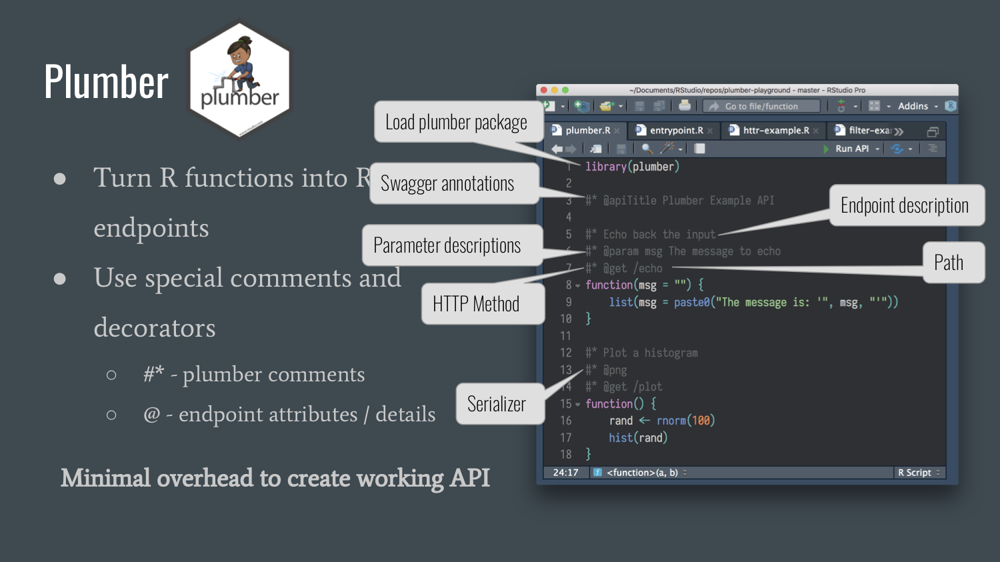

# Building robust APIs in R with [plumber](https://www.rplumber.io)

Talk given at the Big Mountain Data & Dev conference, October 12, 2018. Built on top of [presentation given at SLC RUG](https://github.com/blairj09/slc-rug-plumber).

October 12, 2018

---

This repository contains:

- [All code used for examples](R)
- [A pdf file of the presentation](presentation/slc-rug-plumber-presentation.pdf)

---
